# StepFlow

Animated architecture, flow and sequence diagrams from a short JSON description,
drawn as **one SVG** that plays right here in a README.



You describe what is in the diagram. StepFlow works out the layout, matches the
AWS, Azure, Google Cloud and Kubernetes icons, and animates the path. The SVG
carries its diagram inside it, so anyone can drop it on the
[StepFlow canvas](https://getstepflow.com/app) to move things by hand.

This repository holds the **Claude Code skill**, the spec reference and the
examples. It is also where to [report a bug or ask for something](https://github.com/Figure8-Labs/stepflow/issues).

## Let your agent draw it

Add the skill to Claude Code:

```
/plugin marketplace add Figure8-Labs/stepflow
/plugin install stepflow@stepflow
```

Then ask for a diagram: *"diagram what this pull request changes"*, *"draw our
AWS architecture for the README"*, *"a sequence diagram of the checkout request"*.
The agent writes a spec, runs the CLI, and hands you the SVG.

## Or run the CLI yourself

```bash
npx getstepflow draw spec.json -o diagram.svg
```

Node 18 or later. A spec is a few lines of JSON and has no coordinates in it:

```json
{
  "name": "Order fulfilment",
  "direction": "LR",
  "nodes": [
    { "id": "client", "label": "Client", "sub": "browser" },
    { "id": "orders-api", "label": "Orders API", "icon": "API Gateway" },
    { "id": "order-queue", "label": "Order queue", "icon": "SQS" },
    { "id": "fulfilment", "label": "Fulfilment", "icon": "Lambda" }
  ],
  "edges": [
    { "from": "client", "to": "orders-api", "label": "POST /orders" },
    { "from": "orders-api", "to": "order-queue", "label": "enqueue" },
    { "from": "order-queue", "to": "fulfilment", "label": "consume" }
  ]
}
```

The full format, sequences, frames, notes, loops and icons included, is in
[the spec reference](plugins/stepflow/skills/stepflow-diagram/spec.md).

After someone has moved things by hand on the canvas, redraw onto their copy and
their changes stay:

```bash
npx getstepflow draw spec.json --onto diagram.svg -o diagram.svg
```

## Examples

Each one is drawn by the CLI from the `.json` beside it in [`examples/`](examples).

**Checkout with Stripe**, a sequence



**Web app on Azure**



**Analytics pipeline on Google Cloud**



**A service on Kubernetes**



**Answering from your docs**



**Customer onboarding**, a business process



More at [getstepflow.com/examples](https://getstepflow.com/examples).

## Licence

The contents of this repository (the skill, the spec reference and the examples)
are [MIT](LICENSE).

The CLI, [`getstepflow` on npm](https://www.npmjs.com/package/getstepflow), is free to
use, including commercially and in CI, but it is not open source and its source is not in
this repository. The diagrams you
make with it are yours. See the licence that ships with the package.
